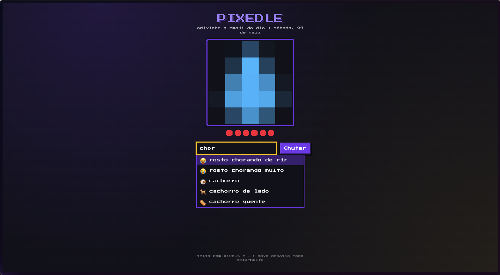

# 🟪 Pixedle

> O desafio diário de adivinhar o emoji escondido. A cada erro, ele fica um pouco menos pixelado.

Pixedle é um joguinho web estilo Wordle. Todo dia o servidor escolhe um emoji secreto. O jogador vê uma versão **muito** pixelada e tem 6 tentativas. A cada erro, o pixel block diminui e o emoji fica mais nítido. A resposta nunca chega ao cliente em texto: o servidor renderiza o PNG já borrado e devolve só o bitmap.



## Como funciona

- O emoji do dia é determinístico: `djb2(new Date().toDateString()) % EMOJIS.length`. Mesmo emoji para todos os jogadores no mesmo dia.
- Estado do jogador (tentativas, acertou, histórico) vive num cookie `httpOnly` assinado com HMAC. Sem banco de dados.
- O cliente nunca recebe o codepoint nem o nome do emoji — pede uma imagem para `/api/emoji-image` e o servidor decide o nível de pixelização a partir da sessão.
- Pixelização: PNG do Twemoji → `sharp` faz downscale (lanczos) para uma grade pequena → upscale (nearest) para 320×320, produzindo blocos chunky. O block size cai de 64 px (level 1) até 1 px (level 6, nítido).

## Stack

- Next.js 14 (App Router) + TypeScript
- Tailwind CSS — paleta retrô (roxo neon `#7c3aed`, amarelo pixel `#facc15`, fundo `#0f0f1a`)
- `sharp` para processamento de imagem no servidor
- Twemoji (CDN jsDelivr) como fonte dos PNGs base
- Press Start 2P (Google Fonts) para o tema pixel art
- Sem banco de dados, sem autenticação — sessão via cookie assinado

## Rodando localmente

```bash
npm install
npm run dev
```

Acesse <http://localhost:3000>. (Se a porta 3000 estiver em uso, o Next sobe em 3001.)

### Variáveis de ambiente

| Nome             | Obrigatória? | Descrição                                                                                                                 |
| ---------------- | ------------ | ------------------------------------------------------------------------------------------------------------------------- |
| `PIXEDLE_SECRET` | em produção  | Chave HMAC usada para assinar o cookie de sessão. Em dev, há um fallback embutido que **não deve ser usado em produção**. |

Crie um `.env.local` para desenvolvimento (já está no `.gitignore`):

```
PIXEDLE_SECRET=alguma-string-longa-e-aleatoria
```

## Estrutura

```
app/
  api/
    daily-info/route.ts     # GET — nível atual, tentativas restantes, histórico
    emoji-image/route.ts    # GET — PNG do emoji do dia, pixelizado pelo nível da sessão
    emoji-list/route.ts     # GET — catálogo público (emoji + nome) para o autocomplete
    guess/route.ts          # POST — recebe { guess } e retorna { correct, attemptsLeft, ... }
  globals.css               # Estilo pixel art, hearts em CSS, botões, inputs
  layout.tsx                # Root layout com Press Start 2P
  page.tsx                  # Tela do jogo

components/
  GuessInput.tsx            # Input com autocomplete (matching NFD/diacritic-insensitive)
  Hearts.tsx                # Vidas em pixel art
  PixelCanvas.tsx           #  que aponta para /api/emoji-image
  ResultModal.tsx           # Modal de fim de jogo com stats e botão de compartilhar

lib/
  daily.ts                  # djb2, seed diária, normalize/match
  emoji-image.ts            # fetch Twemoji + pixelização com sharp + cache em memória
  emojis.ts                 # catálogo curado (~250 emojis com nomes em pt-BR e aliases)
  rate-limit.ts             # token bucket por IP (12 req / 10s)
  session.ts                # leitura/escrita do cookie HMAC-assinado
  sounds.ts                 # bipes via Web Audio API
  stats.ts                  # streak/win-rate em localStorage (apenas no cliente)
  trivia.ts                 # curiosidades hardcoded por emoji
```

## API

### `GET /api/daily-info`

```jsonc
{
  "pixelLevel": 1, // 1 (mais pixelado) — 6 (nítido)
  "attemptsLeft": 6,
  "alreadyWon": false,
  "gameOver": false,
  "history": [],
  "maxAttempts": 6,
}
```

Cria/atualiza o cookie de sessão. Nunca retorna o emoji.

### `POST /api/guess`

Body: `{ "guess": "cachorro" }` (nome em pt-BR, alias ou o próprio emoji colado).

```jsonc
{
  "correct": false,
  "attemptsLeft": 5,
  "pixelLevel": 2,
  "gameOver": false,
  "history": ["cachorro"],
}
```

Em fim de jogo (vitória ou 6 erros), inclui `revealed`, `revealedName` e `trivia`.

### `GET /api/emoji-image`

Retorna o PNG do dia já pixelizado pelo nível atual da sessão. O cliente nunca informa o nível — ele vem do cookie. Headers úteis:

- `content-type: image/png`
- `x-pixel-level: 1..6`
- `cache-control: private, max-age=60`

### `GET /api/emoji-list`

Catálogo público para o autocomplete (sem aliases, sem sinal de qual é o emoji do dia):

```json
{ "emojis": [{ "emoji": "🐶", "name": "cachorro" }, ...] }
```

Todas as rotas são `force-dynamic` e protegidas por rate limit por IP via `x-forwarded-for` / `x-real-ip` / `cf-connecting-ip`.

## Tomada de decisão / armadilhas

- **`sharp` consolida `.resize()` adjacentes** no mesmo pipeline. `resize(N,N).resize(320,320)` vira só o último — silenciosamente quebra a pixelização. Forçamos duas passadas materializando um PNG intermediário com `.toBuffer()` entre os passos. Veja `lib/emoji-image.ts`.
- **Buffer × BodyInit no TS recente.** `@types/node 20.19+` tipa `Buffer` com `ArrayBufferLike` (que aceita `SharedArrayBuffer`), incompatível com `BufferSource`/`BodyInit`. Copiamos para um `Uint8Array(byteLength)` concreto antes de passar ao `NextResponse`.
- **Estado no cookie, não em memória.** Em produção, instâncias múltiplas precisariam compartilhar o estado da sessão se ele fosse in-memory; cookie HMAC torna o servidor stateless.
- **`renderedCache` é por instância.** Em uma deploy serverless, cada cold start re-busca o PNG do Twemoji. Para escala maior, vale plugar Redis ou pré-renderizar diariamente.
